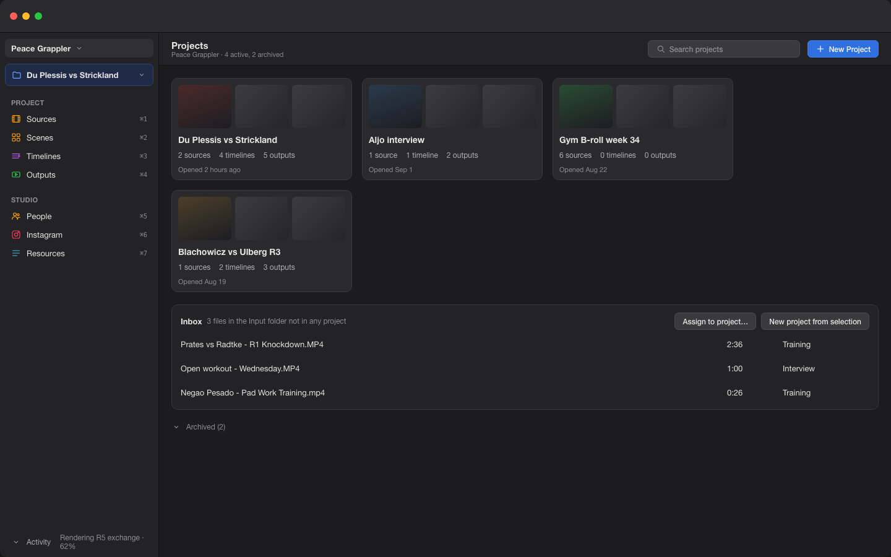
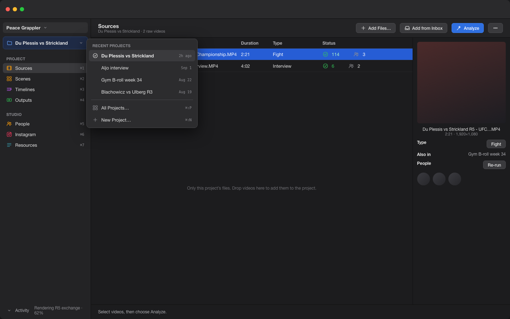
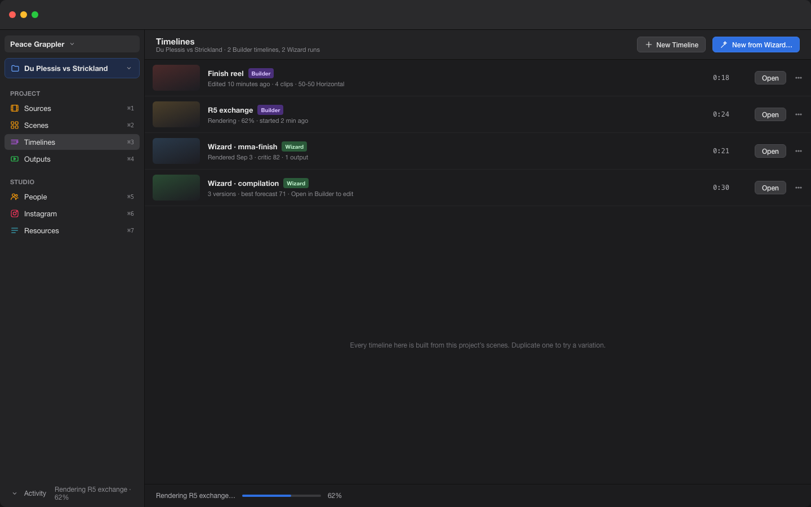
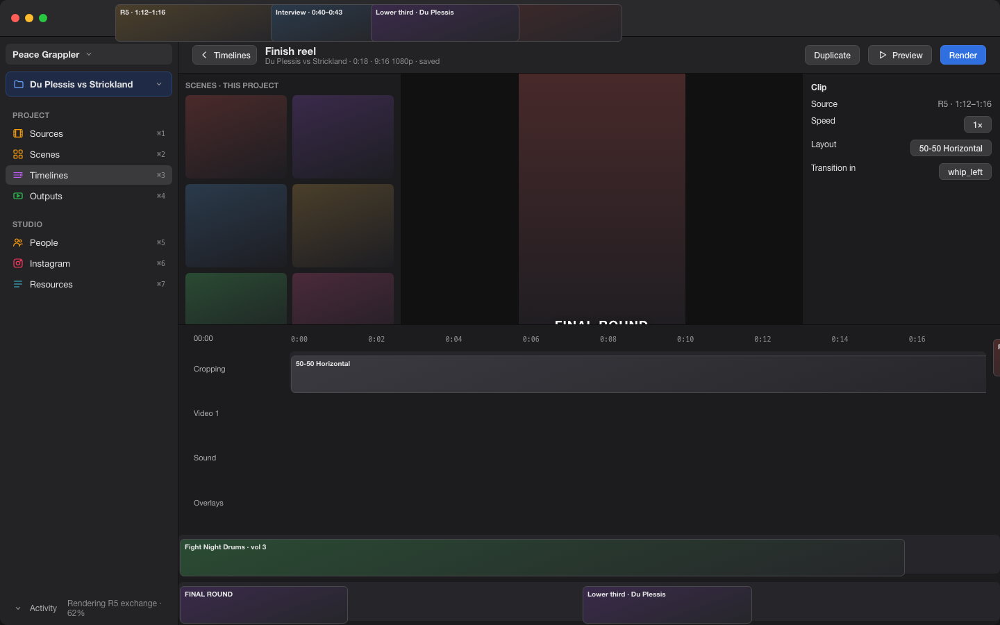

# Projects: a simplified, project-centered UI

Proposal, September 4, 2026. Answer the questions at the end inline; the
assumptions stated next to each will be used otherwise.

**Visual mockup:** https://claude.ai/code/artifact/2e2d180b-2aca-4d25-ac31-fffe736c3370
(editable canvas). Rendered screens are in this folder; the artboard
sources are under `mockup-source/` (`*.dc.html` plus `canvas.json`).

| All Projects (home) | Sources with the project switcher |
|---|---|
|  |  |

| Timelines | Builder as a timeline detail |
|---|---|
|  |  |

## The idea in one paragraph

A **project** is one job: a set of source files, the scenes analyzed from
them, any number of Builder timelines and Wizard runs made from those
scenes, and the outputs those produced. Everything in the middle of the
window is filtered to the current project. You can have any number of
projects, jump between them from one switcher, and each comes back exactly
as you left it: open timeline, playhead, zoom, scene filters, selection.
Profiles stay as they are (brand, folders, database, assets, Instagram
account); projects live inside a profile.

```
Profile  (brand: Peace Grappler)
 ├─ Project  "Du Plessis vs Strickland"
 │    ├─ Sources   2 raw videos → their scenes, people tags, research
 │    ├─ Timelines "Finish reel", "R5 exchange", + Wizard runs
 │    └─ Outputs   5 rendered reels, covers, captions
 ├─ Project  "Aljo interview"
 └─ Project  "Gym B-roll week 34"
Studio (shared by every project in the profile): People, Instagram, Resources
```

## What changes on screen

### Sidebar: two groups instead of five

Today the sidebar lists twelve screens with no notion of which job you are
on. The proposal keeps the same screens but sorts them by *what they
belong to*:

```
┌──────────────────────────────────┐
│ Peace Grappler ▾                 │   profile switcher (unchanged)
│──────────────────────────────────│
│ ▣ Du Plessis vs Strickland   ▾   │   PROJECT SWITCHER  ⌘⇧P
│   ├ Aljo interview               │   recent projects, then
│   ├ Gym B-roll week 34           │   "All Projects…" (home)
│   └ New Project…                 │
│──────────────────────────────────│
│ PROJECT                          │   everything here is filtered
│  ⌘1  Sources                     │   raw videos in this project
│  ⌘2  Scenes                      │   raw + curated, one screen
│  ⌘3  Timelines                   │   Builder timelines + Wizard runs
│  ⌘4  Outputs                     │   library, this project only
│                                  │
│ STUDIO                           │   profile-wide, unfiltered
│  ⌘5  People                      │
│  ⌘6  Instagram                   │   Posts | Reports (existing switch)
│  ⌘7  Resources                   │   Music · Fonts · Images · Overlays
│                                  │   · Effects · Screen Crop as tabs
│──────────────────────────────────│
│ ▸ Activity   Analyzing 2 of 3…   │   pipeline bar (unchanged)
└──────────────────────────────────┘
```

- **Sources** = today's Raw Videos, showing only the project's files, with
  "Add Files…", "Add from Inbox…", and "Add from another project…".
- **Scenes** merges Raw Scenes and Curated Scenes into one grid with a
  segmented control `All | Curated` and the existing batch filter. Both
  screens already share the same rows; the split was by workflow, not by
  data.
- **Timelines** is new: a list of this project's Builder timelines and
  Wizard runs. Opening one loads the Builder; the Builder becomes a
  detail view of a timeline rather than a global singleton.
- **Outputs** = today's Library, filtered to files generated in the
  project, with the same publish, critique, and cover actions.
- **AI Wizard** stops being a screen. It becomes a button in Timelines
  ("New from Wizard…") and in Sources ("Generate…"), and its runs appear
  as rows in Timelines and files in Outputs. The Wizard settings sheet is
  unchanged.
- The six Resources screens become tabs inside one screen to shorten the
  sidebar. Nothing about them changes.

### Home: all projects

`All Projects…` (also the screen shown when a profile has no current
project):

```
┌────────────────────────────────────────────────────────────────────┐
│ Projects                                     [Search]  [+ New Project]│
│                                                                    │
│ ┌───────────────┐ ┌───────────────┐ ┌───────────────┐              │
│ │ ▓▓▓▓ ▓▓▓▓     │ │ ▓▓▓▓          │ │ ▓▓ ▓▓ ▓▓      │              │
│ │ Du Plessis vs │ │ Aljo interview│ │ Gym B-roll 34 │              │
│ │ Strickland    │ │               │ │               │              │
│ │ 2 sources     │ │ 1 source      │ │ 6 sources     │              │
│ │ 3 timelines   │ │ 1 timeline    │ │ 0 timelines   │              │
│ │ 5 outputs     │ │ 2 outputs     │ │ 0 outputs     │              │
│ │ opened 2h ago │ │ Sep 1         │ │ Aug 22        │              │
│ └───────────────┘ └───────────────┘ └───────────────┘              │
│                                                                    │
│ Inbox — 3 files not in any project        [Assign…] [New project from]│
│   poeadasdas.mp4 · fgdfgdfgdfg.MP4 · Negao Pesado - Pad Work.mp4    │
│                                                                    │
│ Archived (2)  ▸                                                    │
└────────────────────────────────────────────────────────────────────┘
```

- Cards show first-frame thumbnails of the sources, counts, and last
  opened. Click opens the project and restores its state. Right-click:
  Rename, Duplicate, Archive, Delete.
- **Inbox** holds files the folder watcher found that no project claims.
  One click makes a project from a file (named after it) or assigns it to
  an existing one. Dropping files on a project card adds them to it.

### Timelines screen

```
┌────────────────────────────────────────────────────────────────────┐
│ Timelines — Du Plessis vs Strickland     [New Timeline] [New from Wizard…]│
│                                                                    │
│  ▓▓▓  Finish reel            0:18   Builder   edited 10 min ago  ▸ │
│  ▓▓▓  R5 exchange            0:24   Builder   edited Sep 3       ▸ │
│  ▓▓▓  Wizard · mma-finish    0:21   Wizard    rendered Sep 3     ▸ │
│  ▓▓▓  Wizard · compilation   0:30   Wizard    3 versions         ▸ │
└────────────────────────────────────────────────────────────────────┘
```

- A Builder timeline is a document: name, created, edited, thumbnail from
  its first clip, duration. Opening it shows the Builder as it is today
  with a back button and the timeline name in the title bar.
- A Wizard run is also a row; "Open in Builder" creates a Builder timeline
  from its plan (this already exists as pre-fill) inside the same project.
- Any number of timelines per project. Duplicate a timeline to try a
  variation.

### Jumping between projects

- The switcher lists recent projects; `⌘⇧P` opens it, `⌘⇧[` and `⌘⇧]`
  cycle. Switching is instant: no re-scan, no refetch beyond the filtered
  lists.
- Per project the app remembers: current sidebar section, open timeline,
  playhead, zoom, scroll, selection, scene filters and sort, Outputs sort.
  Quit and relaunch restores the last project the same way.
- Background work keeps running across switches: an analysis or render
  started in project A continues while you edit project B; the Activity
  bar shows which project each job belongs to, and Outputs of A updates
  when the render lands.

## What stays the same

- Profiles, their folders, database, brand settings, Instagram account,
  and asset libraries. A project never owns assets; it uses the profile's.
- People are profile-wide: a fighter recognized in one project is the same
  person in every project.
- The Builder editor, the Wizard sheet, analysis, curation, critique,
  publishing: same screens, now scoped.
- Keyboard shortcuts keep the `⌘1–⌘7` pattern, renumbered to the new order.

## Data model (for scoping, not user-facing)

- `projects` (id, profile, name, created_at, last_opened_at, archived,
  thumbnail_video_id, ui_state JSON).
- `project_videos` (project_id, video_id) — a video can belong to more
  than one project (Q2 below), so scenes filter through this join.
- `generated_videos.project_id` — outputs belong to the project whose
  timeline or Wizard run produced them.
- `timelines` (id, project_id, name, kind: builder | wizard, document
  JSON, created_at, edited_at, source_run_id for Wizard rows). Replaces the
  single per-profile Builder autosave; autosave writes the open timeline's
  row.
- Wizard runs record their project id; analysis runs stay per video.
- Migration: every existing profile gets one project named after the
  profile containing all its videos, its current Builder autosave as the
  first timeline, and all its generated videos. Nothing is lost; the app
  looks the same on first launch except for the switcher.

## Build order

1. **Data model and migration** (M): tables above, the "everything into
   one project" migration, project id plumbing on outputs and Wizard runs.
2. **Switcher and filtering** (M): project switcher in the sidebar, Sources
   / Scenes / Outputs filtered by project, per-project UI state save and
   restore, Inbox for unassigned files.
3. **Timelines screen** (M): multiple Builder documents per project, the
   list, open and back, Wizard runs as rows, duplicate.
4. **Home screen** (S): cards, search, archive, drag files onto cards.
5. **Sidebar simplification** (S): merged Scenes screen, Resources tabs,
   Wizard demoted to a button, shortcuts renumbered.

Steps 1 and 2 give you the multi-project workflow; 3 gives multiple
timelines; 4 and 5 are polish and can be reordered or dropped.

## Decisions

Settled on September 5, 2026 and expanded in `IMPLEMENTATION-PLAN.md`:

- Projects are per profile.
- Every profile has an undeletable **Home** project holding every file,
  scene, and output; adding a file to any project also shows it in Home.
- A file can belong to several projects; its scenes and analysis are shared.
- New files land in Home, with "Add to project…" from there. The Inbox in
  the mockups is superseded by Home.
- Deleting a project deletes only its timelines. Outputs, files, scenes, and
  analysis stay in Home. The confirmation shows the timeline count and offers
  moving them to Home.
- The Wizard is a sidebar item in every project and plans only from that
  project's sources; in Home it is today's whole-library Wizard.
- The app reopens in its last state (profile, project, section, timeline,
  playhead, zoom, scroll, selection, filters), without restoring open sheets.

Still open: People filtering per project, and favorites replacing curated
scenes (deferred).
